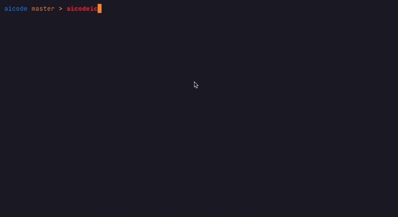

# AiCode

AI-powered CLI agent for software engineering tasks



## Features

- Interactive CLI interface with AI assistance
- Seamless integration with your local development environment
- Support for multiple AI models (OpenAI, Anthropic)
- Persistent memory for project context via rule files

## Installation

### Using Go

```bash
go install github.com/paul-nameless/aicode@latest
```

### Using Docker

```bash
docker run --rm -it -v $PWD:/app -e ANTHROPIC_API_KEY=$(pass show example/claude-api-key| head -n 1) ghcr.io/paul-nameless/aicode:latest
```

### Manual Installation

```bash
git clone https://github.com/paul-nameless/aicode.git
cd aicode
go build .
```

## Configuration

AiCode requires an API key from OpenAI or Anthropic:

### OpenAI

```bash
export OPENAI_API_KEY=your_api_key
aicode
```

### Anthropic

```bash
export ANTHROPIC_API_KEY=your_api_key
aicode
```

## Usage

### Basic Usage

```bash
# Start interactive session
aicode

# Run with a specific prompt
aicode -q "find all TODO comments in the codebase"
```

## Profiles

Profiles let you easily switch between AI Code configurations for different workflows. Example use cases include:

- Commit profile: uses a simple model, non-interactive mode, and a custom commit message prompt
- Task-completion profile: fetches descriptions from Jira/Linear, completes tasks, tests, commits, pushes, and updates task status
- Analysis profile: read-only for code review

Profiles are configured as YAML files in the `configs/` directory. Pass `-c <profile>` to select a profile, e.g. `aicode -c commit`.

### Example profile (`configs/commit.yml`):

```yaml
api_key_shell: "pass show example/openai.com-api-key" # Use shell cmd to get the API key, do not store it in the config file
model: "gpt-4.1-nano" # Model name for this profile
initial_prompt: "Create a commit message for the following changes:..."
non_interactive: true # Disable interactive UI
notify_cmd: "notify-send 'AI finished'" # Sent when AI finished and terminal is not in focus
system_files:
  - AI.md
  - CLAUDE.md
```

## Rule files

By default it can generate `AI.md` file with `/init` command but also it is reading `CLAUDE.md` by default and you can customize files with `system_files` config.

## Ideas

- Realtime voice transcription to control AiCode
- At the end, run aicode with another profile which will check results of first run. It can improve the quality.
- Run multiples aicode instances, each in it's own git workspace, with different models. At the end, let them review others work and vote for the best approach. The best one will be shown to the user first and others to choose from.
- Use reasoning model at the beginning to create a plan to do the task. Maybe run separate contexts for each step of the plan, but give plan at the beginning.

## Slash Commands

Interact using slash commands to streamline your workflow or trigger specific AI-powered tasks. The following commands are available:

- `/help`: Display help information.
- `/init`: Generate an AI.md file with conventions and project context.
- `/clear`: Clear context.
- `/cmd:<name> [arguments]`: Run a custom prompt or workflow associated with `<name>`. Examples:
    - `/cmd:review`: Runs a custom code review prompt on the current changes.
    - `/cmd:commit-msg`: Generates a commit message for staged changes.
    - `/cmd:test-summary`: Summarizes recent test outcomes.

Custom prompts can be added and configured in the `~/.config/aicode/cmds/` directory. Use them to define reusable, specialized AI actions tailored to your workflow. Pass arguments after the command to fine-tune the prompt.

**Examples:**
```bash
/cmd:review last git commit
/cmd:review uncommited changes
```

Example of custom cmd `~/.config/aicode/cmds/`:

```markdown
Review {{.ARGS}}

Focus on:
1. Logic flaws and edge cases
2. Performance bottlenecks
3. Security vulnerabilities
4. Maintainability concerns

Suggest specific improvements with brief explanations. First, give a detailed plan. Then, implement it with the least changes and updating minimal code.
```

## Contributing

Contributions are welcome! Please feel free to submit a Pull Request.
